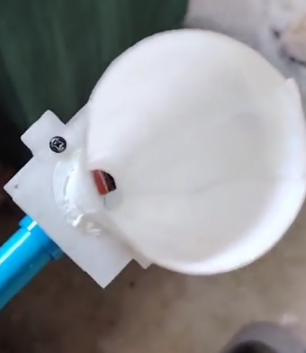
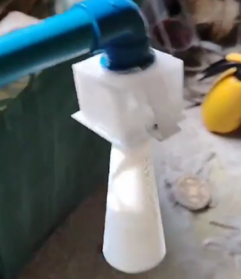
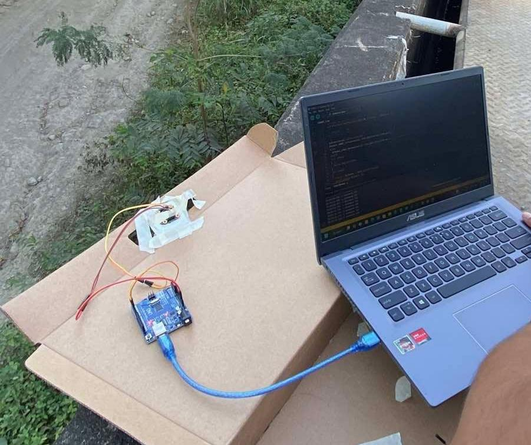

# Distance Sensing for a Low-Cost Water Level Monitoring System Using URM07
This project uses the URM07 ultrasonic sensor to measure water levels without direct contact with the water. The sensor detects the distance between the sensor and the water surface, which is then used to determine the current water level. The collected data is transmitted to an API, which processes and stores the measurements in a database for real-time monitoring and data management.

The sensor measures the distance between itself and the water surface. When the water rises, the distance becomes smaller. When the water falls, the distance becomes larger.

# URM07
The URM07 is an ultrasonic distance sensor that uses sound waves to measure distance.

According to the manufacturer:
Effective range: 20 cm – 750 cm (0.2 m – 7.5 m)
Direction angle: 60°
Resolution: 1 cm
Communication: UART
Frequency: 38–42 kHz

The actual sensing performance can change depending on the environment and the surface being measured.

Controlled vs. Uncontrolled Environment
- In a controlled environment, the sensor can perform more consistently because there are fewer outside factors affecting the ultrasonic signal.
- In an uncontrolled environment, factors such as wind, rain, water movement, temperature, humidity, and unwanted reflections can affect the measurement.

# Using a Cone as an "Ear"
A cone can be placed around the sensor to act like an ear for the ultrasonic signal.

The cone helps focus the ultrasonic waves in one direction.

This may help:
- Reduce unwanted reflections
- Focus the sensor toward the water
- Improve the returning signal
- Make the sensor more reliable in an uncontrolled environment
- Potentially extend the practical sensing range

The idea is that the cone can significantly improve the usable range, especially in real-world environments. However, this would need to be confirmed through further testing.

# Water Level Measurement

The basic idea is:
Water Level = Reference Height - Measured Distance

# Testing Setup

